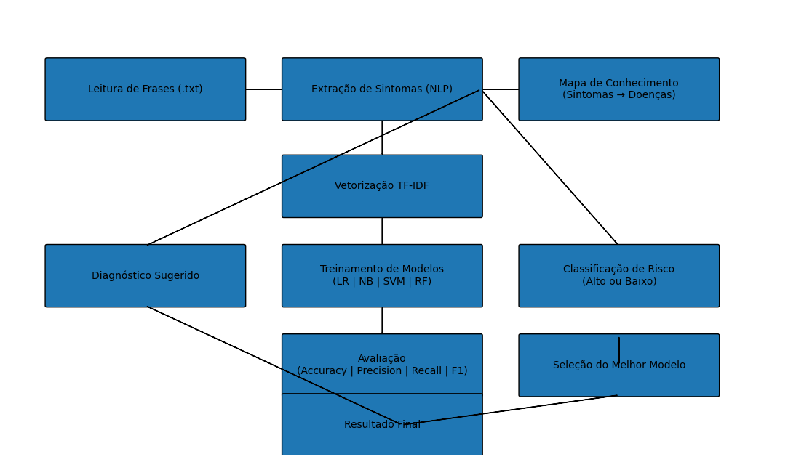

<p align="center">
  
</p>

# CardioIA — Diagnóstico Automatizado com Inteligência Artificial

**FIAP • Fase 2 — Início da IA Avançada: Automação Robótica, Sinapses Artificiais e Computação Quântica**  
**Capítulo 1 — Desafio Integrador: IA entre Robôs, Sinapses e Medicina**

> Projeto acadêmico desenvolvido com foco na simulação de sistemas inteligentes de apoio ao diagnóstico médico, aplicando Processamento de Linguagem Natural (NLP) e Machine Learning ao contexto da cardiologia.

---

## 1. Introdução

Aqui está uma versão **refinada, integrada e com linguagem acadêmica mais robusta**, pensada para causar uma excelente impressão em avaliadores:

---

## 1. Introdução

A crescente incorporação da Inteligência Artificial na área da saúde tem promovido avanços significativos nos processos de triagem, diagnóstico e apoio à decisão clínica. Em cenários contemporâneos, sistemas inteligentes são empregados para analisar grandes volumes de dados, identificar padrões relevantes e auxiliar profissionais na tomada de decisões mais rápidas e assertivas, contribuindo diretamente para a eficiência e qualidade dos serviços médicos.

Nesse contexto, este trabalho apresenta o desenvolvimento do **CardioIA**, uma solução acadêmica que simula, de forma estruturada e didática, a aplicação de técnicas de Inteligência Artificial no apoio à análise de sintomas e na classificação de risco clínico. A proposta fundamenta-se na integração de métodos de Processamento de Linguagem Natural e algoritmos de aprendizado supervisionado, possibilitando a transformação de dados textuais não estruturados em informações relevantes para suporte à decisão.

O sistema desenvolvido é composto por duas etapas principais: (i) a extração de sintomas a partir de descrições textuais fornecidas por pacientes, utilizando técnicas de vetorização baseadas em TF-IDF; e (ii) a classificação do nível de risco clínico por meio de modelos de Machine Learning, com destaque para o algoritmo **Linear Support Vector Machine (SVM)**, que apresentou desempenho superior nos experimentos realizados.

Além dos aspectos técnicos, este estudo também aborda questões críticas relacionadas à aplicação de Inteligência Artificial na saúde, incluindo a qualidade e representatividade dos dados, a presença de possíveis vieses algorítmicos e as limitações inerentes a modelos treinados em bases de dados reduzidas. Tais reflexões são fundamentais para a compreensão dos desafios envolvidos na transposição de soluções acadêmicas para contextos reais.

Dessa forma, o projeto CardioIA não apenas demonstra a viabilidade da aplicação de técnicas acessíveis de Inteligência Artificial em cenários simulados, mas também reforça a importância de uma abordagem crítica, ética e orientada a dados no desenvolvimento de sistemas inteligentes voltados à área da saúde.

---

## 2. Objetivos

### 2.1 Objetivo geral

Simular a automatização de diagnósticos clínicos por meio de Inteligência Artificial, reproduzindo de forma simplificada o funcionamento de sistemas utilizados em hospitais e centros de diagnóstico.

### 2.2 Objetivos específicos

- Extrair sintomas a partir de textos livres utilizando técnicas simples de NLP.
- Relacionar sintomas a possíveis doenças com base em um mapa de conhecimento.
- Classificar o nível de risco clínico por meio de modelos supervisionados de Machine Learning.
- Avaliar o desempenho dos algoritmos com métricas quantitativas.
- Estruturar uma documentação acadêmica clara, organizada e visualmente padronizada.

---

## 3. Estrutura da Solução

A solução foi organizada em três etapas complementares:

### 3.1 Criação dos dados

Nesta etapa, foi construída a base de dados utilizada no projeto, simulando informações clínicas reais em formato estruturado.

Foram desenvolvidos os seguintes artefatos de dados:

1. 📄 [Relatos de sintomas em formato textual](dados/frases_sintomas.txt)
   - arquivo `.txt` contendo frases com relatos de sintomas.
3. 📊 [Mapa de conhecimento (sintomas e doenças)](dados/mapa_sintomas_doencas.csv)
   - arquivo `.csv` com o mapa de conhecimento, relacionando sintomas e doenças.
5. 🤖 [Dataset rotulado para classificação de risco clínico](dados/dataset_risco.csv)
   - dataset rotulado para classificação de risco clínico.

---

Essa fase é essencial, pois a qualidade e a organização dos dados influenciam diretamente o desempenho dos modelos de IA.

### 3.2 Extração de sintomas com NLP

Nesta etapa, foi implementado um processo de Processamento de Linguagem Natural para interpretar frases escritas por pacientes.

O sistema realiza:

- leitura de textos com descrições de sintomas;
- identificação de palavras-chave e expressões relevantes;
- associação dos sintomas com doenças, com base no mapa de conhecimento.

Essa abordagem simula, de forma simplificada, como sistemas inteligentes interpretam linguagem natural para apoiar diagnósticos médicos.

### 3.3 Classificação de risco com Machine Learning

Nesta fase, foi desenvolvido um modelo de Machine Learning para classificar o nível de risco clínico com base nas descrições textuais.

O pipeline inclui:

- leitura das frases simuladas;
- vetorização com TF-IDF;
- treinamento e comparação de modelos;
- seleção do algoritmo com melhor desempenho;
- geração da classificação final de risco.

---

## 4. Pipeline de Processamento Inteligente


### Etapas do pipeline

1. Leitura de frases simuladas de pacientes (`.txt`)
2. Identificação de sintomas por palavras-chave
3. Associação dos sintomas a possíveis doenças via mapa de conhecimento (`.csv`)
4. Vetorização das frases com TF-IDF
5. Treinamento dos modelos de classificação
6. Avaliação com métricas de desempenho
7. Seleção do modelo mais eficiente
8. Geração da classificação de risco

---

## 5. Metodologia

A metodologia adotada seguiu as seguintes etapas:

1. Leitura do dataset  
2. Análise exploratória  
3. Separação das variáveis independentes e dependentes (`X` e `y`)  
4. Vetorização com TF-IDF  
5. Divisão treino/teste em proporção 80/20  
6. Treinamento dos modelos  
7. Avaliação do desempenho  
8. Seleção do melhor modelo  
9. Testes com novas frases  

---

## 6. Dataset

| Frase | Situação |
|---|---|
| "dor no peito e falta de ar" | alto risco |
| "leve incômodo nas costas" | baixo risco |

**Total de registros:** 20

---

## 7. Vetorização com TF-IDF

A representação textual foi convertida em formato numérico por meio de TF-IDF, com as seguintes configurações:

- conversão para minúsculas;
- remoção de acentos;
- uso de unigramas e bigramas.

---

## 8. Modelos Avaliados

Foram comparados os seguintes algoritmos:

- Logistic Regression
- Naive Bayes
- Linear SVM
- Random Forest

---

## 9. Resultados

| Modelo | Acurácia | F1-score |
|---|---:|---:|
| **Linear SVM** | **1.00** | **1.00** |
| Logistic Regression | 0.75 | 0.73 |
| Naive Bayes | 0.75 | 0.73 |
| Random Forest | 0.75 | 0.73 |

**Modelo selecionado:** **Linear SVM**

---

## 10. Exemplos de Teste

### Entrada
> "dor intensa no peito e falta de ar"

### Saída
> **Alto risco**

### Outros exemplos

- "cansaço leve e tontura" → **Baixo risco**
- "palpitação e suor frio" → **Alto risco**

---

## 11. Limitações

- Dataset pequeno.
- Possibilidade de overfitting.
- TF-IDF não captura contexto profundo.

---

## 12. Evoluções Futuras

- Uso de modelos como BERT.
- Ampliação da base de dados.
- Aplicação de redes neurais.
- Implementação de validação cruzada.

---

## 13. Visualização do Projeto

### Fluxo geral



### Acesso ao notebook

O desenvolvimento completo pode ser consultado no notebook abaixo:

👉 [📊 Notebook - Classificação de Risco Clínico](codigo/classificador_risco.ipynb)


---

## 14. Como Executar

### Instalação

```bash
pip install pandas scikit-learn jupyter
```

### Executar a etapa de NLP

```bash
jupyter notebook codigo/extracao_sintomas.ipynb
```

### Executar a etapa de Machine Learning

```bash
jupyter notebook codigo/classificador_risco.ipynb
```

---

## 15. Estrutura do Projeto

```text
cardioia-diagnostico-automatizado/
│
├── codigo/
│   ├── extracao_sintomas.ipynb        # NLP: extração de sintomas a partir de texto
│   └── classificador_risco.ipynb      # Machine Learning: classificação de risco clínico
│
├── dados/
│   ├── frases_sintomas.txt            # Relatos simulados de sintomas
│   ├── mapa_sintomas_doencas.csv      # Mapa de conhecimento (Sintoma → Doença)
│   └── dataset_risco.csv              # Dataset rotulado para classificação de risco
│
├── imagens/
│   ├── cardioia_pipeline.png          # Pipeline do sistema CardioIA
│   └── matriz_confusao.png            # Matriz de confusão dos modelos
│
├── README.md                         # Documentação principal do projeto
└── .gitignore                        # Arquivos ignorados pelo Git
```
---

## 16. Conclusão

Este projeto demonstrou a aplicação de técnicas de Processamento de Linguagem Natural e Machine Learning na classificação de risco clínico a partir de descrições textuais de sintomas.

A vetorização TF-IDF, com unigramas e bigramas, permitiu transformar os dados textuais em representações numéricas adequadas ao treinamento de modelos supervisionados. Entre os algoritmos avaliados, o **Linear SVM** apresentou o melhor desempenho, com equilíbrio entre precisão e recall.

Os resultados evidenciam a capacidade do modelo em distinguir diferentes níveis de risco com baixa taxa de erro no conjunto avaliado. Ainda assim, limitações como o tamanho reduzido da base e a ausência de modelagem semântica mais profunda indicam oportunidades de melhoria.

Como evolução futura, recomenda-se o uso de bases mais robustas e técnicas avançadas, como embeddings e redes neurais, ampliando o potencial da solução em cenários mais próximos da realidade.

---

## 17. Integrantes

| Nome | RM | Contribuição |
|---|---:|---|
| João | RM565999 | Extração de Sintomas (NLP Simples) |
| Endrew Alves | RM563646 | Criação dos Dados (Data Designer) |
| Tayná Esteves | RM562491 | Machine Learning (Classificador de Risco) |
| Carlos Eduardo | RM566487 | Documentação e Organização (GitHub) |

---

## 18. Organização da Equipe

O desenvolvimento do projeto **CardioIA** foi estruturado em etapas, com responsabilidades bem definidas entre os integrantes, seguindo uma abordagem colaborativa.

### 18.1 Divisão de papéis

#### Endrew Alves — Criação dos Dados (Data Designer)

Responsável pela construção e organização da base de dados do projeto.

- Criação das frases simulando relatos de pacientes
- Estruturação do mapa de conhecimento (sintomas → doenças)
- Montagem do dataset para classificação de risco

#### João — Extração de Sintomas (NLP Simples)

Responsável pela implementação da lógica de interpretação textual.

- Leitura das frases de entrada
- Identificação de sintomas por palavras-chave
- Associação com possíveis diagnósticos

#### Tayná Esteves — Machine Learning (Classificador)

Responsável pelo desenvolvimento do modelo de classificação de risco.

- Vetorização com TF-IDF
- Treinamento dos modelos de Machine Learning
- Avaliação de desempenho
- Seleção do melhor modelo

#### Carlos Eduardo — Documentação e GitHub

Responsável pela organização final do projeto e pela entrega.

- Estruturação do repositório no GitHub
- Criação e padronização do README.md
- Documentação técnica e explicativa
- Produção do vídeo demonstrativo

### 18.2 Metodologia de trabalho

A equipe seguiu uma abordagem baseada em divisão modular, na qual cada integrante foi responsável por uma etapa específica do pipeline de Inteligência Artificial, garantindo:

- organização do desenvolvimento;
- clareza nas responsabilidades;
- integração eficiente entre as etapas.

Essa estrutura permitiu a construção de uma solução coesa, simulando o funcionamento de projetos reais na área de tecnologia e saúde.

---

## 19. Diferenciais

- Simulação de diagnóstico com IA
- Uso de NLP aplicado à saúde
- Classificação de risco automatizada
- Estrutura pronta para evolução

---

## 20. Vídeo de Demonstração

**Link:** _inserir link do YouTube aqui_

---

## 21. Considerações Finais

O projeto demonstra como técnicas acessíveis de Inteligência Artificial podem ser aplicadas à área da saúde, auxiliando na triagem e no apoio à decisão clínica.

Mais do que um exercício acadêmico, o **CardioIA** representa uma base sólida para aplicações futuras em sistemas inteligentes de diagnóstico.

---

## 22. Instituição

**FIAP — Faculdade de Informática e Administração Paulista**  
Projeto acadêmico desenvolvido no contexto da disciplina de Inteligência Artificial aplicada a dados.  

**Ano:** 2026
